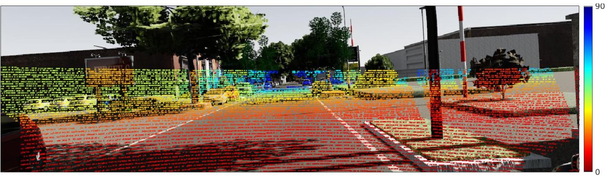
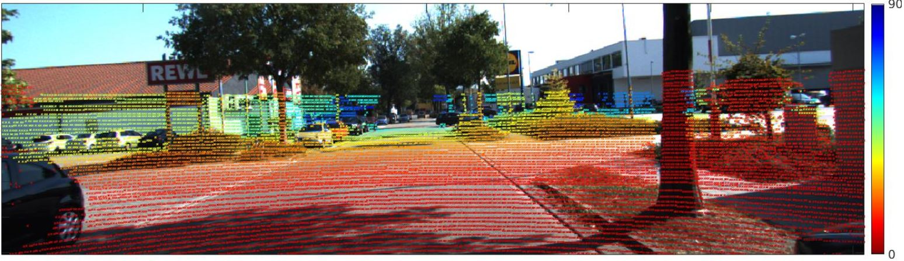
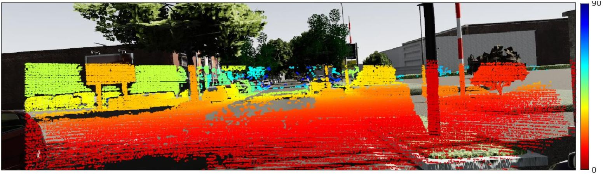
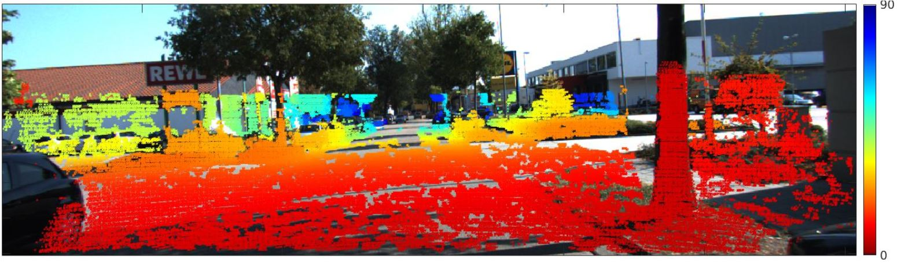

# Twin-Surface-Extrapolation-TWISE-
Code for CVPR 2021 Submission of our paper 'Depth Completion with Twin Surface Extrapolation at Occlusion Boundaries' available at
[paper.](https://arxiv.org/abs/2104.02253)


   where $c1 -> \hat{d_1}, c2 -> \hat{d_2}, and c3 -> \sigma$ respectively. 
# Overview
The following is a teaser result of our proposed algorithm:

Fig.1: Overview of TWISE.
The figure describes how our depth completion algorithm can input LiDAR data and image (a), and extrapolate the estimates of foreground depth $d_1$ (b) and background depth $d_2$ (c), along with a weight $\sigma$ (e). Fusing all three leads to the completed depth (d). The foreground-background depth difference (f) $d_2-d_1$ is small except at depth discontinuities.
# Dependencies
We built our framework on Pytorch 1.3 and CUDA 10.1 in Ubuntu 18.1 and python 3.6. In terminal, the steps are:
1. conda create -n pytorch1.3_twise python=3.6
2. source activate pytorch1.3_twise
3. conda install pytorch==1.3.0 torchvision==0.4.1 cudatoolkit=10.1 -c pytorch

# Training
We will release our training code soon. Stay tuned!

# PreTrained Model
Our best pre-trained model on KITTI is obtained with Multi-Stack HourGlass Network. Our best pre-trained model can be obtained from [here](https://drive.google.com/file/d/1rSNi_XqXQuDtPb9fVzIf8z1liv4mynL_/view?usp=sharing) 


# Evaluation
We also provide an evaluation script to evaluate the model on 1000 validation images of KITTI. Download the selected images folder from [KITTI's website] (http://www.cvlibs.net/datasets/kitti/eval_depth.php?benchmark=depth_completion) and extract it in Data folder. The Data folder should look like this:

```
.
Data
  |__depth_selection
```


  To evaluate the model, just extract the model provided in tar.gz format in the pretrained_models dir and in Codes directory, run:
  
  python evaluate.py --data-folder datapath_dir
  
  where datapath_dir is the folder where Data directory is.  It evaluates the model based the metrics MAE, RMSE, TMAE, TRMSE etc.

# Virtual KITTI 
## Modelling outliers with Semi-Dense GT

VKITTI Sparse Lidar| KITTI 64R Lidar Sparse
---  | ---
   (a)      |         (b)
 | 
VKITTI SemiDense GT | KITTI SemiDense GT
(c)  |  (d)
 | 
Figure 2. Comparison of VKITTI Data vs KITTI Data

We subsample the dense GT depth in azimuth-elevation space to simulate LiDAR-like pattern as sparse inputs (See Figure 2 (a)). 
Further, we created semi-dense VKITTI to simulate outlier noise similar to that existing in real KITTI dataset (See Figure 2 (b)). 
We follow the similar procedure as followed by Uhrig et al when creating semi-dense GT. Refer to Fig.2 for a comparison between semi-dense VKITTI and semi-dense KITTI.

The VKITTI directory structure is in the following format:
```
.
VKITTI_2.0
  |__sampled_depth
     |__Scene01
        |__clone
           |__frames
              |__64R_sampled
                 |__Camera_0
                 |__Camera_1
              |__semi_dense
     |__Scene02        
     |__...
  |__vkitti_2.0.3_depth
  |__vkitti_2.0.3_rgb
```
The VKITTI sampled data can be found from this [link](https://drive.google.com/file/d/16WJh_0PkySp5GQHvclwC7v_hEwT9F866/view?usp=sharing).

# Citations
If you use our method and code in your work, please cite the following:

@inproceedings{ depth-completion-with-twin-surface-extrapolation-at-occlusion-boundaries,
  author = { Saif Imran and Xiaoming Liu and Daniel Morris },
  title = { Depth Completion with Twin-Surface Extrapolation at Occlusion Boundaries },
  booktitle = { In Proceeding of IEEE Computer Vision and Pattern Recognition },
  address = { Nashville, TN },
  month = { June },
  year = { 2021 },
}
